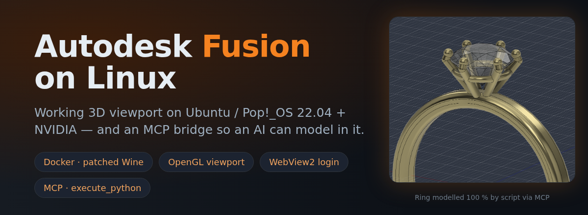
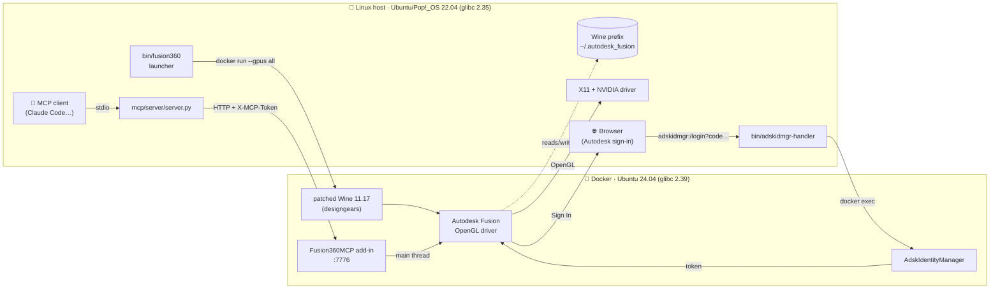
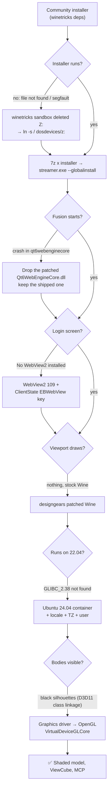
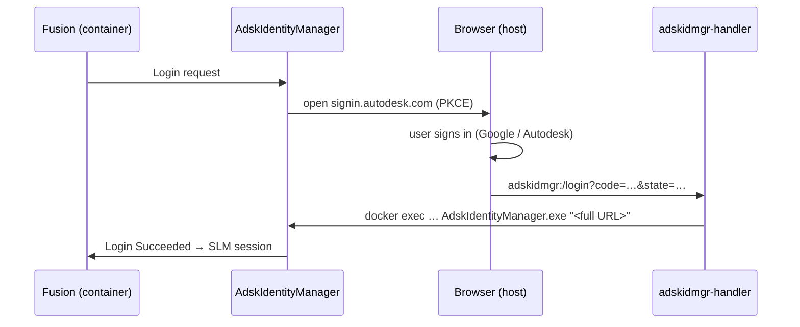

# 🛠️ Autodesk Fusion on Linux



[](LICENSE)
[](https://www.autodesk.com/products/fusion-360)
[](https://github.com/designgears/Autodesk-Fusion-360-for-Linux)
[](docker/Dockerfile)
[](#5%EF%B8%8F%E2%83%A3-switch-fusion-to-opengl)
[](mcp/README.md)

How I got **Autodesk Fusion 2702.x** fully working on **Pop!_OS / Ubuntu 22.04 with an NVIDIA GPU**:
installed, logged in, with a **working 3D viewport**, and **controllable by an AI through MCP**, without upgrading the distro.

> **Tested:** September 2026 · Fusion 2702.1.58 → 2705.1.25 (auto-update) · Pop!_OS 22.04 (glibc 2.35) · NVIDIA RTX 3050, driver 580 · X11.
> One machine, one person. Treat it as a field report, not an official installer. Corrections welcome.
>
> The previous Bottles/Flatpak guide is kept in [`docs/legacy-bottles-flatpak.md`](docs/legacy-bottles-flatpak.md).
> On current builds it gets you to the login screen but **not** to a usable viewport.

## 🧠 How it works



## 🗺️ The road to a working viewport

Every step unblocked the next one. The dead ends are what cost the time:



## ⚡ TL;DR — the five things that mattered

| Problem | Cause | Fix |
|---|---|---|
| Viewport black/white, bodies drawn as black silhouettes | Fusion's Direct3D 11 shaders use **class linkage**, which neither DXVK nor wined3d implement | Switch Fusion's graphics driver to **OpenGL** (`VirtualDeviceGLCore`) |
| Viewport never renders even the grid | Stock Wine lacks the child-window rendering fixes | Use the **[designgears](https://github.com/designgears/Autodesk-Fusion-360-for-Linux) patched Wine** |
| Patched Wine: ``GLIBC_2.38 not found`` | Ubuntu 22.04 ships glibc 2.35 | Run it inside an **Ubuntu 24.04 Docker container** with the NVIDIA runtime |
| "Microsoft WebView2 is required" / `No WebView2 installed` | Runtime missing or not registered where `WebView2Loader.dll` looks | WebView2 **109.0.1518.78** + registry key `EdgeUpdate\ClientState\{…}\EBWebView` |
| Installer does nothing, segfaults, or "file not found" | `winetricks sandbox` **deletes the `Z:` drive** | `ln -s / "$WINEPREFIX/dosdevices/z:"` |

Credit: this builds on [cryinkfly/Autodesk-Fusion-360-for-Linux](https://github.com/cryinkfly/Autodesk-Fusion-360-for-Linux)
(archived Feb 2026) and the maintained fork [designgears/Autodesk-Fusion-360-for-Linux](https://github.com/designgears/Autodesk-Fusion-360-for-Linux),
which provides the patched Wine used here.

---

## 🧰 Requirements

- NVIDIA GPU with the proprietary driver, X11 session
- Docker + [nvidia-container-toolkit](https://docs.nvidia.com/datacenter/cloud-native/container-toolkit/) (`docker run --gpus all` must work)
- [winehq-staging](https://wiki.winehq.org/Ubuntu) on the host (only to prepare the prefix)
- `7z` (`p7zip-full`), `xdotool` optional
- ~15 GB of disk, **~4 GB of free RAM** while Fusion runs

The scripts assume these paths (override them with environment variables):

```
WINEPREFIX=$HOME/.autodesk_fusion/wineprefixes/default
WINE_DIR=$HOME/fusion-wine-build
```

---

## 1️⃣ Prepare the Wine prefix

Create the prefix with the community installer's dependency step (winetricks: dotnet, vcrun, cjkfonts, win11,
DXVK overrides…). I used the cryinkfly installer with the host `winehq-staging`; designgears ships the same steps.

**Then fix what `winetricks sandbox` broke:**

```bash
ln -s / "$WINEPREFIX/dosdevices/z:"
```

Without `Z:` Wine cannot see anything under `/home`: the installer "crashes", segfaults (exit 139), or
`ShellExecuteEx` says *file not found*. It looks like a Fusion bug; it isn't.

## 2️⃣ Install Fusion (skip the self-extractor)

The admin installer is a 7-Zip SFX (`7zS.sfx`) wrapping a Python `streamer.exe` plus the full payload.
The SFX part is what fails under Wine, so unpack it on Linux and run the streamer directly:

```bash
curl -L -o FusionAdminInstall.exe "https://dl.appstreaming.autodesk.com/production/installers/Fusion%20Admin%20Install.exe"
mkdir admin_x && cd admin_x && 7z x ../FusionAdminInstall.exe
WINEPREFIX="$WINEPREFIX" wine "$PWD/streamer.exe" --globalinstall --quiet
```

About 7 GB ends up in `Program Files/Autodesk/webdeploy/production/<hash>/`.
A final abort about `NETAPI32.dll.NetGetJoinInformation` is harmless.

**Do not** apply the community's patched `Qt6WebEngineCore.dll` (06-2025) to 2702.x: it crashes inside
`qt6webenginecore` right after startup. Keep the one Fusion ships.

## 3️⃣ WebView2 109 (login screen)

Fusion's login uses WebView2. Versions ≥ 120 don't render under Wine; **109.0.1518.78** does
(standalone installers: [aedancullen/webview2-evergreen-standalone-installer-archive](https://github.com/aedancullen/webview2-evergreen-standalone-installer-archive)).

The installer tends to hang in `MicrosoftEdgeUpdate.exe`. If it does, the runtime is just a folder:
copy `EdgeWebView/Application/109.0.1518.78` into `drive_c/Program Files (x86)/Microsoft/` and register it.
**The `ClientState\EBWebView` value is the one people miss.** `WebView2Loader.dll` reads it, and without it
IdentityManager logs `Prerequisites to launch IM screen not met. No WebView2 installed`:

```bash
G='{F3017226-FE2A-4295-8BDF-00C3A9A7E4C5}'
V='C:\Program Files (x86)\Microsoft\EdgeWebView\Application\109.0.1518.78'
for K in "HKLM\\SOFTWARE\\WOW6432Node\\Microsoft\\EdgeUpdate\\Clients\\$G" "HKCU\\Software\\Microsoft\\EdgeUpdate\\Clients\\$G"; do
  wine reg add "$K" /v pv /t REG_SZ /d 109.0.1518.78 /f
  wine reg add "$K" /v location /t REG_SZ /d 'C:\Program Files (x86)\Microsoft\EdgeWebView\Application' /f
done
for K in "HKLM\\SOFTWARE\\WOW6432Node\\Microsoft\\EdgeUpdate\\ClientState\\$G" \
         "HKLM\\SOFTWARE\\Microsoft\\EdgeUpdate\\ClientState\\$G" \
         "HKCU\\Software\\Microsoft\\EdgeUpdate\\ClientState\\$G"; do
  wine reg add "$K" /v EBWebView /t REG_SZ /d "$V" /f
done
# keep Edge from auto-updating itself to a broken version
wine reg add 'HKLM\SOFTWARE\Policies\Microsoft\EdgeUpdate' /v UpdateDefault /t REG_DWORD /d 0 /f
wine reg add 'HKLM\SOFTWARE\WOW6432Node\Policies\Microsoft\EdgeUpdate' /v UpdateDefault /t REG_DWORD /d 0 /f
```

At this point Fusion already starts and logs in with the host `winehq-staging`, but the viewport stays empty.

## 4️⃣ Patched Wine in Docker

Download `fusion-wine-build.tar.gz` from the
[designgears releases](https://github.com/designgears/Autodesk-Fusion-360-for-Linux/releases), check its `SHA256SUMS`,
and extract it to `$HOME` (→ `~/fusion-wine-build`, Wine 11.17).
On 22.04 it fails with ``GLIBC_2.38 not found``, and so does their GE-Proton build. So build a small
Ubuntu 24.04 runtime image (this build is pure WoW64, so no i386 libraries are needed):

```bash
docker build -t fusion-wine:latest \
  --build-arg USERNAME="$USER" \
  --build-arg LOCALE=en_US.UTF-8 \
  --build-arg TZONE="$(cat /etc/timezone)" \
  docker/
```

The three build args are not cosmetic:

| Build arg | What breaks without it |
|---|---|
| `USERNAME` | uid 1000 is `ubuntu` in the image → Wine creates a new `drive_c/users/ubuntu` profile → your login is gone |
| `LOCALE` | Wine starts in the `C` locale → Fusion crashes in `nsaddinmgr10` during *initialize server addins* |
| `TZONE` | *"Your time is not synchronized with the server"*. Mounting `/etc/localtime` does **not** help |

## 5️⃣ Switch Fusion to OpenGL

With Direct3D 11 (DXVK or wined3d) the grid and ViewCube draw but **bodies do not**. DXVK logs
`D3D11Device::CreateShaderModule: Class linkage not supported`, and those are exactly the surface shaders.
Fusion still ships an OpenGL backend. With Fusion **closed**, change `driverOptionId` in **both** option files:

```
drive_c/users/<you>/AppData/Roaming/Autodesk/Neutron Platform/Options/NMachineSpecificOptions.xml   (UTF-16!)
drive_c/users/<you>/AppData/Local/Autodesk/Neutron Platform/Options/NMachineSpecificOptions.xml
```

```xml
<driverOptionId ... UserName="Graphics driver" Value="VirtualDeviceGLCore"/>
```

The Roaming file is UTF-16, so plain `sed` silently does nothing. For example:

```bash
python3 - "$FILE" <<'PY'
import sys; p=sys.argv[1]; b=open(p,'rb').read()
enc='utf-16' if b[:2] in (b'\xff\xfe',b'\xfe\xff') else 'utf-8'
s=b.decode(enc).replace('Value="VirtualDeviceDx11"','Value="VirtualDeviceGLCore"', 1)
open(p,'wb').write(s.encode(enc))
PY
```

The log should then say `Initializing OGS Device: VirtualDeviceGLCore ... Success!`.

## 6️⃣ Launch

```bash
bin/fusion360            # docker run ... wine Fusion360.exe
docker rm -f fusion360   # hard stop
```

Never run the container and a host Wine on the same prefix at the same time: two wineservers corrupt it.

## 7️⃣ Login callback



`Sign In` opens your normal browser. At the end the browser gets `adskidmgr:/login?code=…&state=…`.
[`bin/adskidmgr-handler`](bin/adskidmgr-handler) passes it to `AdskIdentityManager.exe` with `docker exec`
inside the running container, so it reaches the same wineserver as Fusion. No `nsenter` or `sudo` needed
(that was the hard part of the Bottles guide). Register it:

```ini
# ~/.local/share/applications/adskidmgr-handler.desktop
[Desktop Entry]
Type=Application
Name=Autodesk Identity Manager (Docker)
Exec=/path/to/bin/adskidmgr-handler %u
NoDisplay=true
MimeType=x-scheme-handler/adskidmgr;
```

```bash
xdg-mime default adskidmgr-handler.desktop x-scheme-handler/adskidmgr
```

Always pass the full URL as an argument. `wine start adskidmgr:...` truncates at the first `&` and PKCE fails.

> I tested the Docker-side `docker exec` into Fusion's wineserver. The actual login in this setup was done
> earlier with the host Wine (same prefix, same flow). The session token is stored in the prefix and survives.

The login window may sit on a black splash. Click inside it and the *Sign In* button appears.

---

## 8️⃣ Optional: let an AI assistant model in Fusion (MCP)

[`mcp/`](mcp/) contains an MCP server + Fusion add-in with a `fusion_execute_python` tool (full Fusion API),
token-protected. See [`mcp/README.md`](mcp/README.md).

---

## 🐞 Troubleshooting

| Symptom | Where to look / fix |
|---|---|
| Nothing obvious, just a crash | `drive_c/users/<you>/AppData/Local/Autodesk/Neutron Platform/logs/AppLogFile*.log`, look for `Crashing thread` and the module list under it |
| Login problems | `.../AppData/Local/Autodesk/Identity Services/Log/IdServices.log` |
| DXVK details | run with `DXVK_LOG_LEVEL=info DXVK_LOG_PATH=...` |
| Fusion sees the NVIDIA card as "Vendor: AMD" | DXVK hides NVIDIA by default. The launcher sets `DXVK_CONFIG="dxgi.hideNvidiaGpu = False"` |
| "Fusion Service Utility" window pops up | Several crashes in a row. Close it and fix the cause; no need to *Repair* |
| Recovered-documents dialog on every start | Fusion was killed with an unsaved doc. *Close* keeps it under File → Recover Documents |
| A Python add-in stops auto-starting | Fusion skips add-ins that were running when it was killed. Re-enable in Shift+S |
| `OctoPrint_for_Fusion360` error `failed to find product CAMProductType` | Remove the bundle from `AppData/Roaming/Autodesk/ApplicationPlugins` if you don't use it |

## 📁 Files

| File | Purpose |
|---|---|
| [`docker/Dockerfile`](docker/Dockerfile) | Ubuntu 24.04 runtime for the patched Wine (NVIDIA Vulkan ICD, locale, TZ, user) |
| [`bin/fusion360`](bin/fusion360) | Launcher (`docker run` with GPU, X11 and `$HOME`) |
| [`bin/adskidmgr-handler`](bin/adskidmgr-handler) | Browser → IdentityManager login callback through `docker exec` |
| [`mcp/`](mcp/) | Optional MCP server + Fusion add-in (`execute_python`, token-protected) |
| [`docs/legacy-bottles-flatpak.md`](docs/legacy-bottles-flatpak.md) | Previous Bottles/Flatpak guide (May 2026) |

## 📄 License

[MIT](LICENSE). Autodesk Fusion is proprietary software from Autodesk; this repo only contains scripts and notes.
